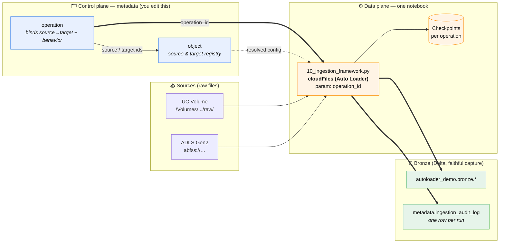
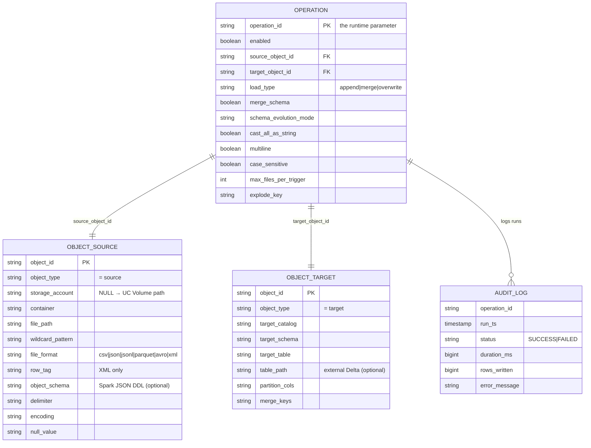
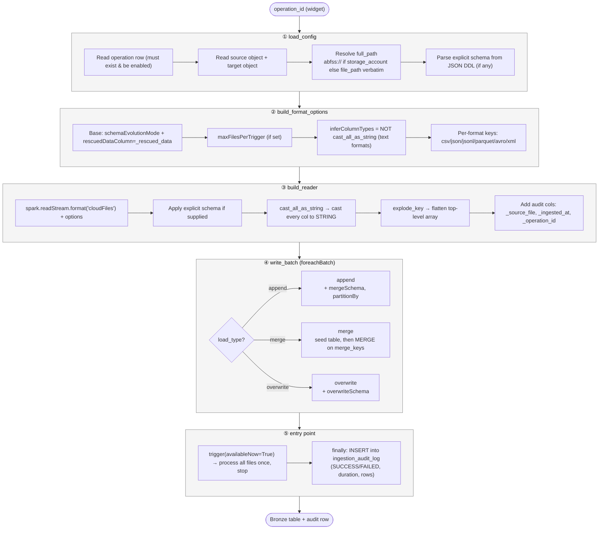
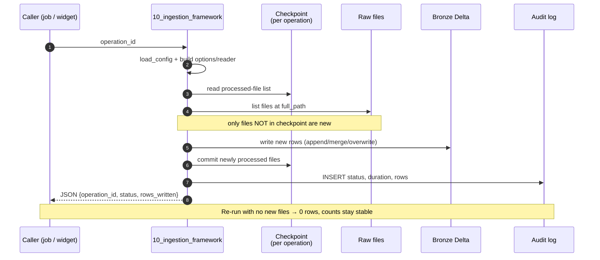
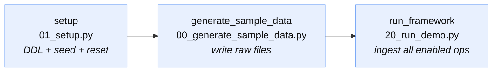
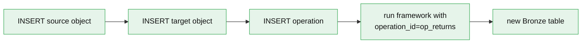

# Metadata-Driven Auto Loader Ingestion Framework

A source-agnostic Bronze ingestion framework for Databricks. **One** parameterized
notebook ingests **any** source — POS Parquet, headerless supplier CSV, CRM JSON, EDI
XML, clickstream JSONL, multi-year historical loads — because it reads all of its
behavior from metadata tables at runtime. Onboarding a new source is a metadata `INSERT`,
not a code deployment.

> A pipeline runs. A framework governs. A pipeline knows about one source. The framework
> knows how to handle any source because it reads its instructions from configuration.

Inspired by Divyansh Goyal's article, [*Stop Writing Ingestion Pipelines. Build a
Framework Instead using Databricks Autoloader*](https://medium.com/@divyanshgoyal8989/stop-writing-ingestion-pipelines-build-a-framework-instead-using-databricks-autolaoder-ffc90761a245).

---

## Table of contents

1. [Product Requirements (PRD)](#1-product-requirements-prd)
2. [Architecture](#2-architecture)
3. [Repository layout](#3-repository-layout)
4. [The demo sources](#4-the-demo-sources)
5. [How to run](#5-how-to-run)
6. [Onboarding a new source](#6-onboarding-a-new-source-the-whole-point)
7. [Using ADLS (abfss) instead of UC Volumes](#7-using-adls-abfss-instead-of-uc-volumes)
8. [Configuration reference](#8-configuration-reference)

---

## 1. Product Requirements (PRD)

### Problem
Retail data teams accumulate dozens of near-identical ingestion notebooks — one per
source, per format. A schema change from any source team breaks whichever notebook reads
it. Historical loads need bespoke handling. Onboarding a new source is a week of
engineering. The problem isn't the code, it's the approach: building pipelines where a
framework is needed.

### Goal
Replace N per-source pipelines with **one config-driven framework** on top of Databricks
Auto Loader, so that the framework code stays stable and the *configuration* absorbs all
source variation.

### Functional requirements
| # | Requirement | How the framework satisfies it |
|---|-------------|--------------------------------|
| R1 | Files processed **exactly once**, safe across restarts | Auto Loader checkpoints (per-operation `schemaLocation` + file tracking) |
| R2 | **Every file format** without forking code | `file_format` + format options resolved from metadata; one reader |
| R3 | Historical loads **survive years of schema drift** | `cast_all_as_string` lands every column as STRING; typing deferred to Silver |
| R4 | Source schema changes **without warning** don't break loads | `schema_evolution_mode` (`addNewColumns` / `rescue` / `failOnNewColumns` / `none`) + `merge_schema` |
| R5 | Unexpected data **never disappears** | `_rescued_data` column captures off-schema payloads |
| R6 | Parsing quirks live in **configuration, not code** | delimiter, encoding, null token, XML rowTag, multiline, explode key — all metadata |
| R7 | Every run is **observable** | `ingestion_audit_log` records status, duration, rows, errors per run |

### Non-goals
- Business typing / cleansing (that is Silver's job — Bronze captures faithfully).
- Building a custom file-tracking system (Auto Loader already solved it).

### Design principles
- **Bronze captures data; it does not interpret it.**
- Complexity moves from code into configuration.
- Rescued data is a *signal* (upstream changed), not just a fallback.

---

## 2. Architecture

### 2.1 The big picture

The framework cleanly separates a **control plane** (metadata you edit) from a **data
plane** (the single notebook that executes). The only coupling between a source and the
engine is one runtime parameter: `operation_id`.



**How to read it:** you describe a source and a target as rows in `object`, then bind
them with a row in `operation`. At runtime you hand the framework a single
`operation_id`; it resolves the full config, reads the raw files with Auto Loader,
writes faithfully to a Bronze Delta table, tracks processed files in a per-operation
checkpoint (for exactly-once), and records the outcome in the audit log.

### 2.2 The metadata model

Two tables drive everything. `object` is a **sparse, type-discriminated** registry:
a row is either a `source` (where/how to read) or a `target` (where/how to write).
`operation` joins one source to one target and declares the run behavior.



> Both `OBJECT_SOURCE` and `OBJECT_TARGET` above are the **same physical table**
> (`metadata.object`); the diagram splits them only to show which columns each row
> *type* uses. Source rows leave the `target_*` columns NULL and vice-versa.

### 2.3 Execution flow — the five steps

The notebook (`10_ingestion_framework.py`) is a straight, branch-light pipeline. All
format-specific logic collapses into Step 2; there are no per-source `if` branches
elsewhere.



### 2.4 Exactly-once across restarts

Each operation owns an isolated checkpoint directory under the `checkpoints` volume.
Auto Loader records which files it has already processed there, so re-running an
operation is safe — only **new** files are ingested.



### 2.5 Summary of the runtime contract

| Stage | Function | Driven by | Output |
|-------|----------|-----------|--------|
| ① | `load_config` | `operation` + `object` rows | flat config dict |
| ② | `build_format_options` | `file_format`, evolution & parsing flags | Auto Loader options dict |
| ③ | `build_reader` | path, schema, `cast_all_as_string`, `explode_key` | streaming DataFrame + audit cols |
| ④ | `write_batch` | `load_type`, `merge_keys`, `partition_cols` | Bronze Delta table |
| ⑤ | entry point | `availableNow=True` | audit row + notebook exit JSON |

---

## 3. Repository layout

```
autoloader_framework/
├─ databricks.yml                         # Asset bundle definition
├─ resources/
│  └─ autoloader_framework.job.yml        # Lakeflow Job orchestrating the demo
├─ src/
│  ├─ sql/
│  │  ├─ 01_setup_metadata.sql            # DDL: catalog, schemas, volumes, metadata tables
│  │  └─ 02_seed_metadata.sql             # Seed: 6 demo retail sources
│  └─ notebooks/
│     ├─ 01_setup.py                       # Runs the .sql DDL+seed on serverless (job task 1)
│     ├─ 00_generate_sample_data.py        # Writes sample files into the landing volume
│     ├─ 10_ingestion_framework.py         # THE framework (parameterized by operation_id)
│     └─ 20_run_demo.py                    # Driver: runs every enabled operation + inspects
└─ README.md
```

The Lakeflow Job (`autoloader_framework.job.yml`) wires three notebook tasks in
sequence: `setup` → `generate_sample_data` → `run_framework`.



---

## 4. The demo sources

Six operations seeded by `02_seed_metadata.sql`, each exercising a different capability:

| operation_id | Format | Load type | What it demonstrates |
|--------------|--------|-----------|----------------------|
| `op_pos_transactions` | Parquet | append (partitioned) | Columnar source, additive schema evolution |
| `op_supplier_acme` | CSV (headerless, `\|`) | append | Explicit JSON-DDL schema, custom delimiter/null token |
| `op_crm_customers` | JSON (multiline) | **merge** | Upsert current-state records on `customer_id` |
| `op_supplier_edi` | XML (`rowTag=Order`) | append | XML parsing entirely from config |
| `op_clickstream` | JSONL | append | `explode_key` flattens a top-level `events[]` array |
| `op_loyalty_history` | CSV | append | `cast_all_as_string` survives multi-year type drift |

The headline scenario is `op_loyalty_history`: the 2018 file has a **numeric**
`customer_tier` (`1,2,3`) and the 2024 file has a **string** one (`Bronze,Silver,Gold`).
Because `cast_all_as_string = true`, both land together without a type conflict — the
exact incident that motivated the framework.

---

## 5. How to run

> Prereq: the `autoloader_demo` **catalog must exist**. On metastores with *Default
> Storage* (no metastore storage root), create it once with a managed location, e.g.:
> ```bash
> databricks catalogs create autoloader_demo \
>   --storage-root "abfss://<container>@<account>.dfs.core.windows.net/<path>/autoloader_demo"
> ```
> (or via the UI using Default Storage). The `.sql` keeps a portable
> `CREATE CATALOG IF NOT EXISTS`; the setup notebook **skips** it since the catalog is a
> prerequisite here. Everything else (schemas, volumes, tables, seed) is created for you.

### Option A — one command (recommended), fully on serverless
```bash
databricks bundle validate -t dev
databricks bundle deploy   -t dev
databricks bundle run autoloader_framework_demo -t dev
```
The job runs three tasks: **setup** (DDL + seed + reset) → **generate_sample_data** →
**run_framework** (ingests every enabled operation, then emits a JSON summary with
per-operation status and Bronze row counts).

Verified end-to-end result (serverless): all six operations `SUCCESS` —
`pos_transactions`=20, `supplier_acme_inventory`=4, `crm_customers`=4,
`supplier_edi_orders`=2, `clickstream_events`=3, `loyalty_history`=4.

### Option B — interactively
Run the notebooks in order: `01_setup.py` → `00_generate_sample_data.py` →
`20_run_demo.py`. To ingest a single source, run `10_ingestion_framework.py` with the
widget `operation_id` set (e.g. `op_crm_customers`).

The framework notebook also exposes three other widgets with sensible defaults:
`metadata_catalog` (`autoloader_demo`), `metadata_schema` (`metadata`), and
`checkpoint_root` (`/Volumes/autoloader_demo/landing/checkpoints`).

### Re-running & idempotency
- A full `bundle run` is **reproducible**: `01_setup.py` drops the Bronze tables and
  clears checkpoints, so counts are identical every time.
- To demonstrate **exactly-once across restarts**, re-run *only* the `run_framework`
  task — checkpoints then persist and already-processed files are skipped (counts stay
  stable). Drop a new file into the landing volume and only the delta is ingested.

---

## 6. Onboarding a new source (the whole point)

No code. Insert one source object, one target object, and one operation:

```sql
-- describe the source
INSERT INTO autoloader_demo.metadata.object (object_id, object_type, file_path,
  wildcard_pattern, file_format, description, created_at)
VALUES ('src_returns', 'source', '/Volumes/autoloader_demo/landing/raw/returns/',
  '*.json', 'json', 'Returns feed', current_timestamp());

-- describe the target
INSERT INTO autoloader_demo.metadata.object (object_id, object_type, target_catalog,
  target_schema, target_table, description, created_at)
VALUES ('tgt_returns', 'target', 'autoloader_demo', 'bronze', 'returns', 'Bronze returns',
  current_timestamp());

-- bind them with behavior
INSERT INTO autoloader_demo.metadata.operation (operation_id, enabled, source_object_id,
  target_object_id, load_type, merge_schema, schema_evolution_mode, cast_all_as_string,
  multiline, case_sensitive, max_files_per_trigger, explode_key, description, created_at)
VALUES ('op_returns', true, 'src_returns', 'tgt_returns', 'append', true, 'addNewColumns',
  false, false, false, 1000, null, 'Append returns JSON', current_timestamp());
```

The next scheduler cycle (or a manual run of `10_ingestion_framework` with
`operation_id=op_returns`) picks it up. No notebook. No PR. No deployment.



---

## 7. Using ADLS (abfss) instead of UC Volumes

The demo uses a UC Volume so it runs anywhere. To point a source at ADLS Gen2, set
`storage_account` + `container` on the source object and put the container-relative path
in `file_path`. The framework then resolves:

```
abfss://{container}@{storage_account}.dfs.core.windows.net{file_path}{wildcard_pattern}
```

When `storage_account` is NULL, `file_path` (plus `wildcard_pattern`) is used verbatim —
which is what makes the same code work for UC Volumes. Everything else — format options,
evolution, write routing — is identical.

---

## 8. Configuration reference

**`object` (source columns):** `storage_account`, `container`, `file_path`,
`wildcard_pattern`, `file_format` (`csv`/`json`/`jsonl`/`parquet`/`avro`/`xml`),
`row_tag` (XML), `object_schema` (Spark JSON DDL), `delimiter`, `encoding`, `null_value`.

**`object` (target columns):** `target_catalog`, `target_schema`, `target_table`,
`table_path` (external), `partition_cols`, `merge_keys`.

**`operation`:** `load_type` (`append`/`merge`/`overwrite`), `merge_schema`,
`schema_evolution_mode` (`addNewColumns`/`rescue`/`failOnNewColumns`/`none`),
`cast_all_as_string`, `multiline`, `case_sensitive`, `max_files_per_trigger`,
`explode_key`, `enabled`.

### Behavioral notes worth knowing
- **Explicit schema + `addNewColumns`:** Auto Loader rejects `schemaEvolutionMode=addNewColumns`
  when an explicit schema is supplied. The framework automatically falls back to `none`
  for explicit-schema sources; off-schema data is still preserved via `_rescued_data`.
- **`inferColumnTypes`** is set to the inverse of `cast_all_as_string`, and only for
  inferable text formats (`csv`, `json`, `jsonl`, `xml`).
- **`case_sensitive`** is retained in metadata for downstream/Silver use; Auto Loader has
  no `cloudFiles.caseSensitive` option, so Bronze capture stays at the Spark default.
- **Audit columns** added to every row: `_source_file`, `_ingested_at`, `_operation_id`
  (plus `_rescued_data` from Auto Loader).
- **`merge` first run:** if the target table doesn't exist yet, the first batch seeds it
  with an append; subsequent batches `MERGE` on `merge_keys`.
- **Row counting on serverless:** because `foreachBatch` runs server-side on Spark
  Connect, the framework derives `rows_written` from `query.recentProgress` rather than a
  client-side counter.
